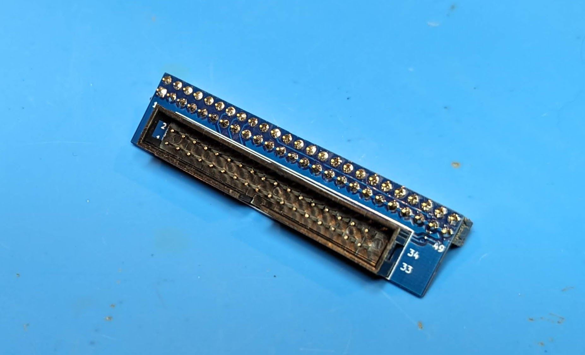

Slimmed down version of https://github.com/pski/fd50to34.  For the Big Board you do NOT need to close any of the solder jumpers on the back.

### BOM

| Part                                         | Source                                                       |
| -------------------------------------------- | ------------------------------------------------------------ |
| 2x25 50pin 2.54mm Female Straight Pin Header | [Aliexpress](https://www.aliexpress.us/item/3256801594858362.html) |
| 2x17 34pin 2.54mm Male Straight Box Socket   | [Aliexpress](https://www.aliexpress.us/item/2251832660396046.html) |

### Assembly

I soldered the female header, then the box socket.  If you buy extra parts, you can use them to support the other side of the board to make it level.

