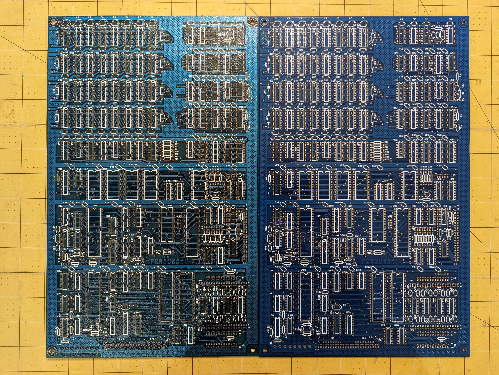
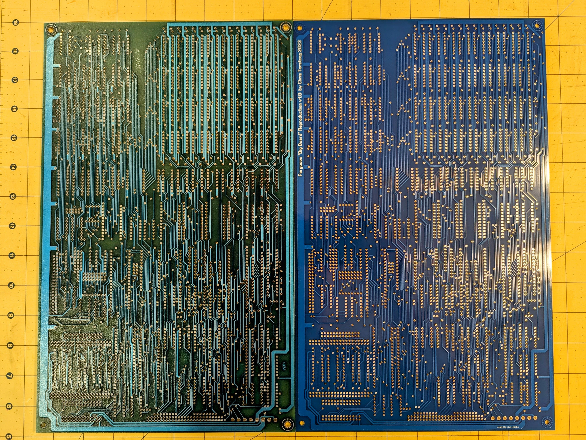
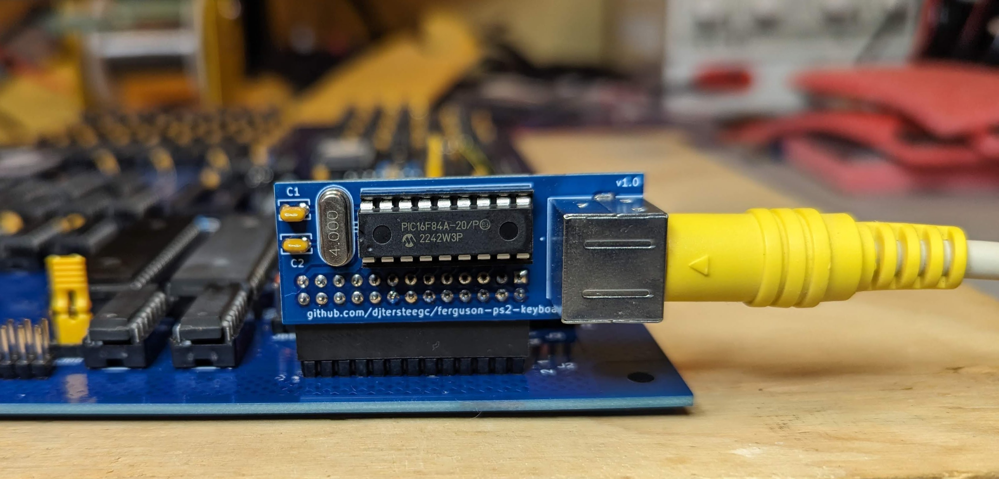
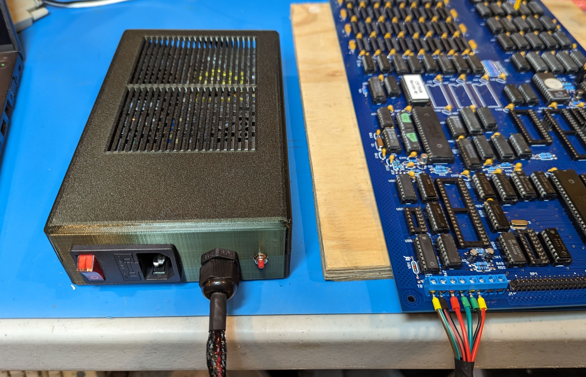
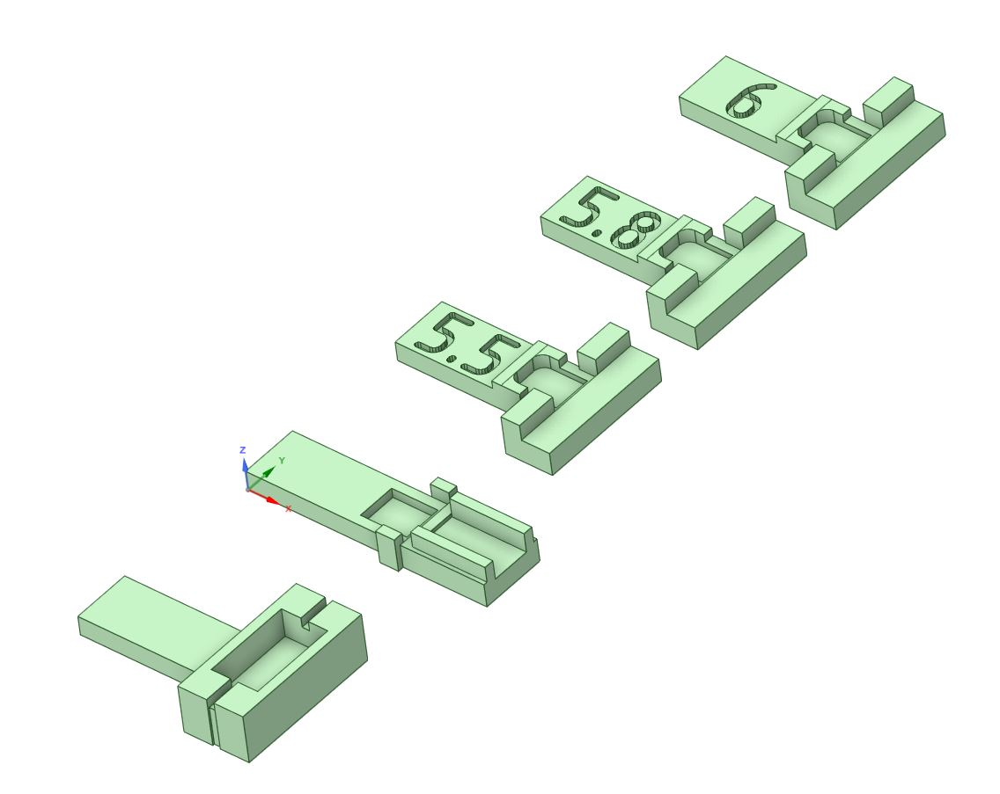

## Still a work in progress, if you are interested in a version 1.0 board to help debug and get this design working, see the VCF forum thread below.

# Ferguson Big Board Reproduction

Original is on the left above, the repoduction is on the right. Redraw in Sprint Layout from scans of an unpopulated board, serial number B4088.  Project discussion thread on VCF is at https://forum.vcfed.org/index.php?threads/recreating-the-ferguson-big-board.68349/

Mostly original with the following changes:

Silkscreen of U52 corrected from a DIP-16 to DIP-14 socket.

Silkscreen reference Q1 added

Silkscreen reference Q2 added

Silkscreen reference R21 added

Silkscreen reference C142 added

Added missing vias for the top two memory bank -5V traces

Pin 14 silkscreen reference on J2 (keyboard connector) corrected to read pin 2

Jumper JB7 added to switch line character count between 97 and 128.  Strap middle pin to top pin to connect U11 pin 3 to +5V for 128 counts. Strap middle pin to bottom pin to connect U11 pin 3 to U10 pin 2 for 97 counts. *Micro Cornucopia, Number 10, February 1983, page 32*

Jumper JB8 added to switch between 7 and 8 dot character widths. Strap middle pin to top pin to connect U24 pin 3 to +5V for 7 dots. Strap middle pin to bottom pin to connect U24 pin 3 to GND for 8 dots. *Micro Cornucopia, Number 10, February 1983, page 32*

### Original Schematic Errata

**Sheet 4 - Floppy, Keyboard PIO, CTC**

IORQ input on U111 (PIO) should be pin 36, not pin 34

Connector J1-6 (Low Current) connects to resistor network pin RN1-2, not RN1-3.

Resistor networks RN1 and RN2 are labeled RP1 and RP2 respectively on the PCB silkscreen

##### Sheet 5 - GP PIO/SIO

BAUDA and BAUDB are reversed, U107 (8116) Pin 12 is BAUDB, U107 (8116) Pin 8 is BAUDA

### **V1.0 PCB Errata**

Like the original board, VPP on the Character Set EPROM (U73, pin 21) is unconnected and needs to be wired to +5V (U73, pin 24) for normal operation.

C114 pads have the footprint of vias and no symbol on the silkscreen layer.  Same as the original, but could be improved.

Right pad R40 unconnected, should be connected on bottom copper to the base of Q2 above it.

Top pad of R25 unconnected, should be connected on top copper to top pad of R26.

Pins 4 and 5 at U77 unconnected, should be connected on bottom copper.

Pins 19 and 20 on U65 unconnected, should be connected on bottom copper.

RP2-6 and J1-42 are unconnected, should be connected on bottom copper.

RP1-2 and J1-6 are unconnected, should be connected on top copper.

U81 pin 1 should be connected on top copper to the via immedately to it's right which goes to U84 pin 5. 

U22 pin 8 should be connected to the trace running immediately above it to connect to U9 pin 11 and U25 pin 5.  There is a via under U21by pin 9 that can complete this connection.

U37 pin 6 should be connected to trace running immediately below it to connect to U38 pin 10 and U10 pin 5. A bodge between U37-6 and U38-10 is the most direct.

U35 pin 1 should be connected to the +5V rail immediately above it.

### Serial Keyboard Adapter

I also created a PS/2 to parallel keyboard adapter PCB that should plug right into the Big Board based on the work shared here, https://forum.vcfed.org/index.php?threads/ferguson-big-board-1-monitor-rom.32705/#post-405189.  It's available at https://github.com/djtersteegc/ferguson-ps2-keyboard-adapter

### Power

The manual calls for the following:

+5V at 3 amps

+12V at 0.25 amps

-12V at 0.20 amps

Either a Mean Well RT-50B (5V@4A) or RT-65B (5V@5A) will do the job. I chose the slighty larger RT-65B since it was only a few bucks more. 3D printable case designs for both that also incorporate the reset button are available in the [psu](psu/README.md) directory.

### **Other Links**

Original manuals and schematics  on BitSaver - http://www.bitsavers.org/pdf/ferguson/Big_Board_1980.pdf 

Enrico's excellent collection of information and other links - https://www.vintagesbc.it/vintage-computer-board/collezione/ferguson-big-board-i/

ShadowTron's YouTube series on restoring an original board - https://www.youtube.com/watch?v=K9SL5NfVGII&list=PLAvOjNk-JGgWwtCWdAmB9IXlpt3gtpXcv&ab_channel=ShadowTronBlog  He also has additional docmentation in his repo at https://github.com/nbreeden2/FergusonBigBoard

### **Building Tips**

An updated BOM is available at https://docs.google.com/spreadsheets/d/1wBH6rk6youMYVbVZ4vIVZXSmrotHBEZvTTkY6PEE75M/edit?usp=sharing  The one in the manual is missing some components and has the incorrect value for the video crystal.

Most of the capacitors have a 6.35mm lead spacing, 3D printable lead forming tools are available in the **tools** directory of this repo for modifying the more standard (these days) 5.08mm spacing of generic MLCC caps.  There is also a bender for the axial tantalums.

There is likely going to be a bit of a bend in a PCB of this size, so make sure your sockets are tight to the board before soldering them down.  I find it's quicker to tack one leg, flip the board, and then use your finger to **gentely** push the socket down while reheating the single solder joint.  You can also tape/blue tack the sockets before soldering (takes longer) or buy the fancy sockets that snap into the board but that will get really expensive give the component count here.

The single row jumpers JP1, JP7, and JP8 are tight between the adjacent sockets, so make sure they fit before you completely solder the IC sockets down.

