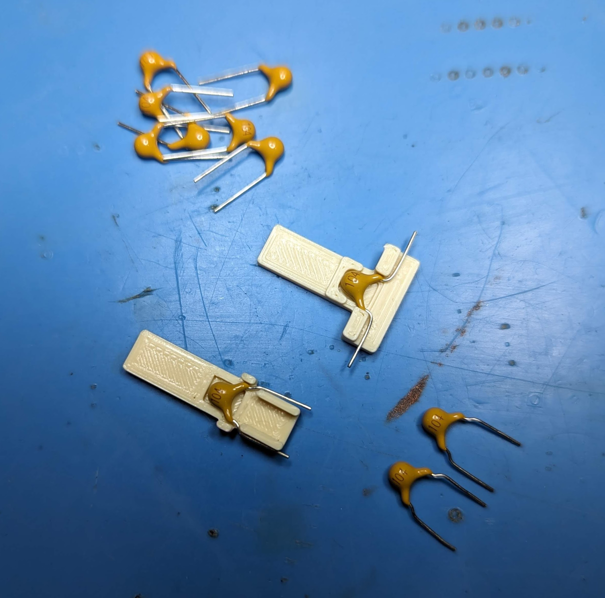

# Ferguson Big Board Reproduction

Redraw in Sprint Layout from scans of an unpopulated board, serial number B4088.  Project discussion thread on VCF is at https://forum.vcfed.org/index.php?threads/recreating-the-ferguson-big-board.68349/

Mostly original with the following changes:

- Silkscreen of U52 corrected from a DIP-16 to DIP-14 socket.
- Silkscreen reference Q1 added
- Silkscreen reference Q2 added
- Silkscreen reference R21 added
- Silkscreen reference C142 added
- Added missing vias for the top two memory bank -5V traces
- Pin 14 silkscreen reference on J2 (keyboard connector) corrected to read pin 2
- Jumper JB7 added to switch line character count between 97 and 128.  Strap middle pin to top pin to connect U11 pin 3 to +5V for 128 counts. Strap middle pin to bottom pin to connect U11 pin 3 to U10 pin 2 for 97 counts. *Micro Cornucopia, Number 10, February 1983, page 32*
- Jumper JB8 added to switch between 7 and 8 dot character widths. Strap middle pin to top pin to connect U24 pin 3 to +5V for 7 dots. Strap middle pin to bottom pin to connect U24 pin 3 to GND for 8 dots. *Micro Cornucopia, Number 10, February 1983, page 32*

Like the original board, VPP on the Character Set EPROM (U73, pin 21) is unconnected and needs to be wired to +5V (U73, pin 24) for normal operation.

**V1.0 Errata**

C114 pads have the footprint of vias and no symbol on the silkscreen layer.  Same as the original, but could be improved.

Right pad R40 unconnected, should be connected on back copper to the base of Q2 above it.

Top pad of R25 unconnected, should be connected on top copper to top pad of R26.

**Other Links**

Original manuals and schematics  on BitSaver - http://www.bitsavers.org/pdf/ferguson/Big_Board_1980.pdf 

Enrico's excellent collection of information and other links - https://www.vintagesbc.it/vintage-computer-board/collezione/ferguson-big-board-i/

ShadowTron's YouTube series on restoring an original board - https://www.youtube.com/watch?v=K9SL5NfVGII&list=PLAvOjNk-JGgWwtCWdAmB9IXlpt3gtpXcv&ab_channel=ShadowTronBlog  He also has additional docmentation in his repo at https://github.com/nbreeden2/FergusonBigBoard

**Building Tips**

An updated and validated BOM is available at https://docs.google.com/spreadsheets/d/1wBH6rk6youMYVbVZ4vIVZXSmrotHBEZvTTkY6PEE75M/edit?usp=sharing

Most of the capacitors have a 6.35mm lead spacing, 3D printable lead forming tools are available in the tools directory of this repo for modifying the more standard (these days) 5.08mm spacing of generic MLCC caps.

