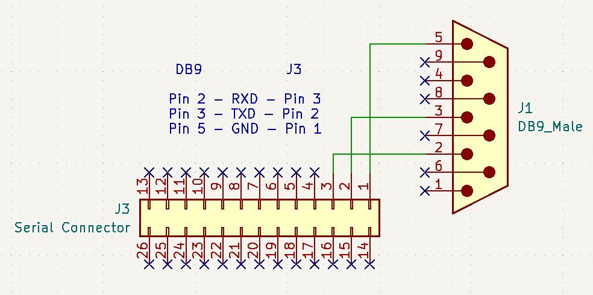

# Ferguson Big Board Reproduction

Original is on the left above, the repoduction is on the right. Redraw in Sprint Layout from scans of an unpopulated board, serial number B4088.  Project discussion thread on VCF is at https://forum.vcfed.org/index.php?threads/recreating-the-ferguson-big-board.68349/ Currently composite output, serial and keyboard input, and disk operations have been confirmed on v1.0 boards with the appropiate rework documented below.  Still need to confirm CTC and the extra PIO function as intended.

Mostly original with the following changes:

Silkscreen of U52 corrected from a DIP-16 to DIP-14 socket.

Silkscreen reference Q1 added

Silkscreen reference Q2 added

Silkscreen reference R21 added

Silkscreen reference C142 added

Added missing vias for the top two memory bank -5V traces

Pin 14 silkscreen reference on J2 (keyboard connector) corrected to read pin 2

Jumper JB7 added to switch line character count between 97 and 128.  Strap middle pin to top pin to connect U11 pin 3 to +5V for 128 counts. Strap middle pin to bottom pin to connect U11 pin 3 to U10 pin 2 for 97 counts. *Micro Cornucopia, Number 10, February 1983, page 32*

Jumper JB8 added to switch between 7 and 8 dot character widths. Strap middle pin to top pin to connect U24 pin 3 to +5V for 7 dots. Strap middle pin to bottom pin to connect U24 pin 3 to GND for 8 dots. *Micro Cornucopia, Number 10, February 1983, page 32*

### Original Schematic Errata

**Sheet 4 - Floppy, Keyboard PIO, CTC**

IORQ input on U111 (PIO) should be pin 36, not pin 34

Connector J1-6 (Low Current) connects to resistor network pin RN1-2, not RN1-3.

Resistor networks RN1 and RN2 are labeled RP1 and RP2 respectively on the PCB silkscreen

The output from U87 pin 4 that controls the two 74LS242 buffers, U99 and U100, does not go though U103 and instead hooks directly to the 74LS242 chips.  This makes sense since you need a high signal to the buffers to read data from the FD1771 which U87 (NOR) outputs when both 1771CS and RDB are asserted active low.

##### Sheet 5 - GP PIO/SIO

BAUDA and BAUDB are reversed, U107 (8116) Pin 12 is BAUDB, U107 (8116) Pin 8 is BAUDA

### **V1.0 PCB Errata**

Like the original board, VPP on the Character Set EPROM (U73, pin 21) is unconnected and needs to be wired to +5V (U73, pin 24) for normal operation.

C114 pads have the footprint of vias and no symbol on the silkscreen layer.  Same as the original, but could be improved.

Right pad R40 unconnected, should be connected on bottom copper to the base of Q2 above it.

Top pad of R25 unconnected, should be connected on top copper to top pad of R26.

Pins 4 and 5 at U77 unconnected, should be connected on bottom copper.

Pins 19 and 20 on U65 unconnected, should be connected on bottom copper.

RP2-6 and J1-42 are unconnected, should be connected on bottom copper.

RP1-2 and J1-6 are unconnected, should be connected on top copper.

U81 pin 1 should be connected on top copper to the via immedately to it's right which goes to U84 pin 5. 

U22 pin 8 should be connected to the trace running immediately above it to connect to U9 pin 11 and U25 pin 5.  There is a via under U21by pin 9 that can complete this connection.

U37 pin 6 should be connected to trace running immediately below it to connect to U38 pin 10 and U10 pin 5. A bodge between U37-6 and U38-10 is the most direct.

U35 pin 1 should be connected to the +5V rail immediately above it.

### **V1.1 PCB**

In the works...

### Serial Keyboard Adapter

I also created a PS/2 to parallel keyboard adapter PCB that should plug right into the Big Board based on the work shared here, https://forum.vcfed.org/index.php?threads/ferguson-big-board-1-monitor-rom.32705/#post-405189.  It's available at https://github.com/djtersteegc/ferguson-ps2-keyboard-adapter

### Power

The manual calls for the following:

+5V at 3 amps

+12V at 0.25 amps

-12V at 0.20 amps

Either a Mean Well RT-50B (5V@4A) or RT-65B (5V@5A) will do the job. I chose the slighty larger RT-65B since it was only a few bucks more. 3D printable case designs for both that also incorporate the reset button are available in the [psu](psu/README.md) directory.

### Composite Video Output

On JB1 connect pins 10 and 11, pins 3 and 4, and pins 5 and 6.  This routes both the v.sync and h.sync signals to the composite output, and inverts the video (white on black). Then build a cable using something like a Dupont two pin 2.54mm connector and connect you ground to pin 9 and signal to pin 10 on connector J6.

If you want to make a fancy composite video adapter PCB, head over to the [composite-video-adapter](composite-video-adapter/README.md) directory.

### Serial Terminal

Instead of a keyboard and monitor, you can also operate the BigBoard via a serial termainl connected to the B channel connector J3.  For a DB9 male DTE cable wire accordingly, I used a three pin Dupont connector.  

  

On JB5 jumper pins 3 and 6, and pins 9 and 10.  You will need to use a null modem cable to connect to your terminal device, or PC USB adapter running something like Terraterm.

The port will autobaud when you hit the return key, up to 19.2K.  I run the terminal set to 19,200 baud, 7 bit, odd parity, 1 stop bits, with no flow control.  When you startup or reset the big board, the first device, keyboard or serial terminal, that sends a return character will become the input and output device for the board.

### Floppy Drive

A number of disk image compatible with a Flash Floppy converted Gotek are available in the [flashfloppy](flashfloppy) directory.  Copy the content of the directoy to a USB stick and make sure you are using an up to date version of the Flash Floppy firmware.

To convert the 50 pin drive connector to a 34 pin floppy drive, you can build the adapter in the [50-to-34-pin-floppy-adapter](50-to-34-pin-floppy-adapter/README.md) directory.

The general purpose 50 to 34 pin adapter available at https://github.com/pski/fd50to34 has also been tested and works well.

### PIO Port and Blinken LED's

What good is an extra PIO port without something for it to do?  Build yourself a sixteen [LED blinken board](pio-port-blinkenlights/README.md) and make it dance.

[https://youtu.be/wRvbjzvjgtw](https://youtu.be/wRvbjzvjgtw)

### **Other Links**

Original manuals and schematics  on BitSaver - http://www.bitsavers.org/pdf/ferguson/Big_Board_1980.pdf 

Enrico's excellent collection of information and other links - https://www.vintagesbc.it/vintage-computer-board/collezione/ferguson-big-board-i/

ShadowTron's YouTube series on restoring an original board - https://www.youtube.com/watch?v=K9SL5NfVGII&list=PLAvOjNk-JGgWwtCWdAmB9IXlpt3gtpXcv&ab_channel=ShadowTronBlog  He also has additional docmentation in his repo at https://github.com/nbreeden2/FergusonBigBoard

### **Building Tips**

An updated BOM is available at https://docs.google.com/spreadsheets/d/1wBH6rk6youMYVbVZ4vIVZXSmrotHBEZvTTkY6PEE75M/edit?usp=sharing  The one in the manual is missing some components and has the incorrect value for the video crystal.

Most of the capacitors have a 6.35mm lead spacing, 3D printable lead forming tools are available in the **tools** directory of this repo for modifying the more standard (these days) 5.08mm spacing of generic MLCC caps.  There is also a bender for the axial tantalums.

There is likely going to be a bit of a bend in a PCB of this size, so make sure your sockets are tight to the board before soldering them down.  I find it's quicker to tack one leg, flip the board, and then use your finger to **gently** push the socket down while reheating the single solder joint.  You can also tape/blue tack the sockets before soldering (takes longer) or buy the fancy sockets that snap into the board but that will get really expensive give the component count here.

The single row jumpers JP1, JP7, and JP8 are tight between the adjacent sockets, so make sure they fit before you completely solder the IC sockets down.

The resistor networks RP1 and RP2 and are also tight against the 50 pin disk connector J1, so I installed a cable first to confirm clearance and then angled the networks back a bit before soldering them in.

