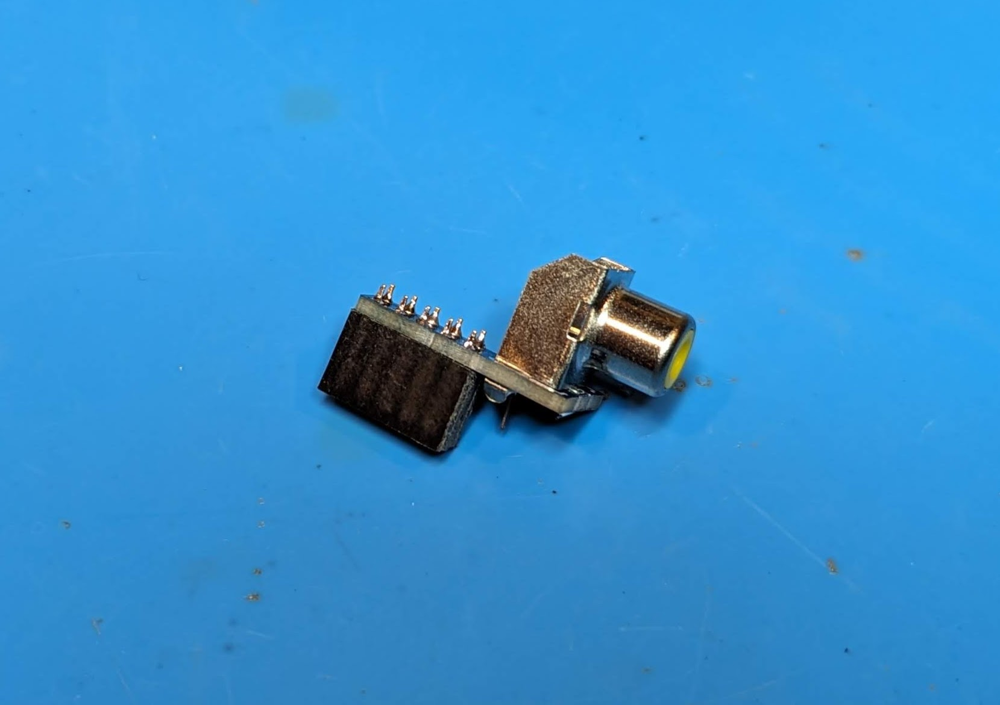

If you don't want to make your own composite cable.

### BOM

The composite jack is one of standard AliExpress models, often called [AV-103B](https://www.aliexpress.us/item/3256803528316207.html).  Similar to a CUI Devices RCJ-014.

2x5p 2.54mm double row female pin header socket.  I buy the [2x40P](https://www.aliexpress.us/item/2251832703602124.html) models and cut them down (it's cheaper), and you need them for the keyboard, floppy, and blinken board PCB's.

### Assembly

Should be self explanatory. I soldered the 2x5 IDC socket first, followed by the jack.

