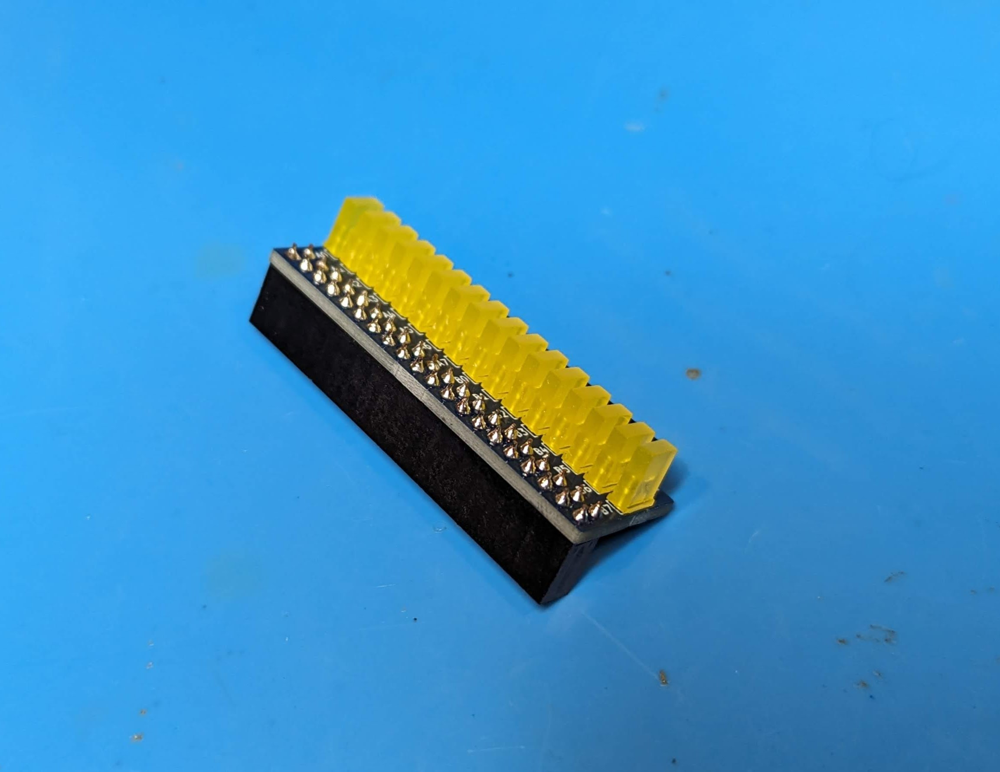
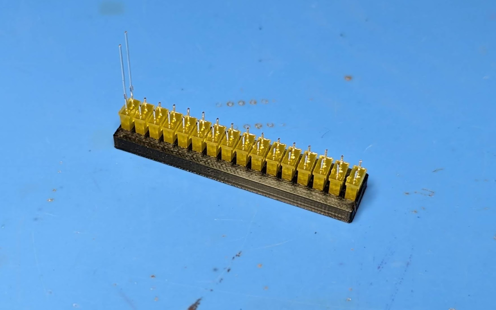

### BOM

| Part                                         | Qty  | Source                                                       |
| -------------------------------------------- | ---- | ------------------------------------------------------------ |
| 2x20 40pin 2.54mm Female Straight Pin Header | 1    | [Aliexpress](https://www.aliexpress.us/item/3256801594858362.html) |
| 2 x 5 x 7mm LED (pick your favorite color)   | 16   | [Aliexpress](https://www.aliexpress.us/item/2255800718649696.html) |
| 9 pin 470R Resistor Network Array            | 2    | [Aliexpress](https://www.aliexpress.us/item/2251832653789055.html) |

### Assembly

If you have a 3D printer, print the assembly jig, and plug in all the LED's observing polarity.  I cut them all down, except for one, to ease with insertion into the PCB.

Pin one on the resistor array's both point towards the middle of the PCB.

### Software

On the PASCAL.img disk there a various blinken programs and exectutables written in Turbo Pascal 3.0a.