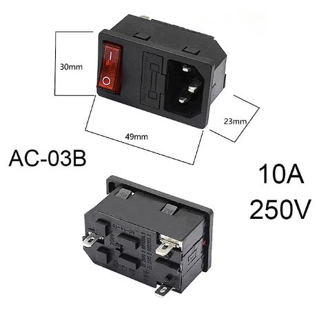
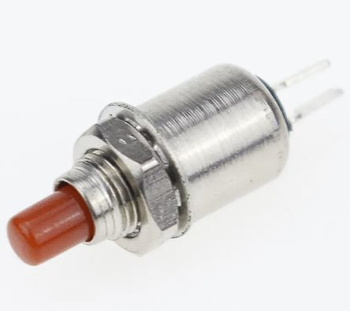
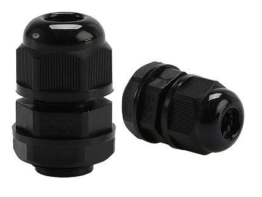
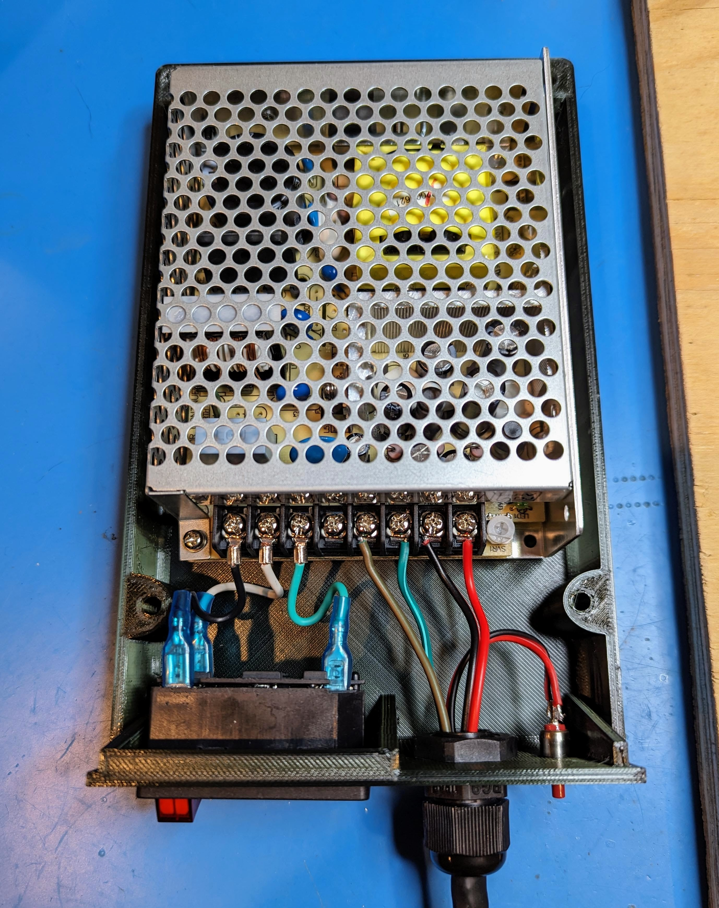

First off, credit to [mozzwald](https://mozzwald.com/) who designed the [original version](https://www.thingiverse.com/thing:5178605) of this case around an RT-50 PSU for the Coleco ADAM community.  All I did was add the reset button and stretched it a bit for the larger RT-65 version.  Print both the top and bottom of the case face down. I used supports on the button only for the IEC, cable, and button openings.  20% infill should be fine.  All the parts other than the PSU came from AliExpress shops, but you can also find these parts on Amazon or the usual electronic suppliers if you want slightly nicer (and more expensive) versions of everything.

### BOM

[IEC Inlet](https://www.aliexpress.us/item/3256802824106295.html) I used one with a lighted switch, but it turned out to be neutral switched (China, why?) instead of the line switched so caveat emporium.  Lots of different options in this form factor.

[5mm Momentary Switch](https://www.aliexpress.us/item/2255799950576497.html)

[PG9 Size Cable Gland](https://www.aliexpress.us/item/2251832790063427.html)

Two M3x6mm screws to hold down the PSU

Four M3x20mm or #4 x 1 inch screws to hold the case halves together

Whatever you want to use for wires, sheating, heatshrink, terminals, etc.

### Assembly

Should be self explanatory.  I ran the wires through the sheating/gland and then soldered the switch on after they were attached to the case.

